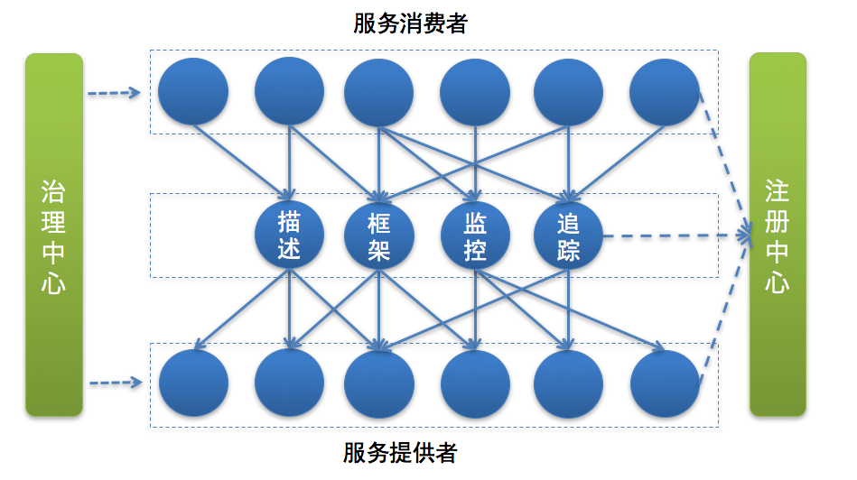
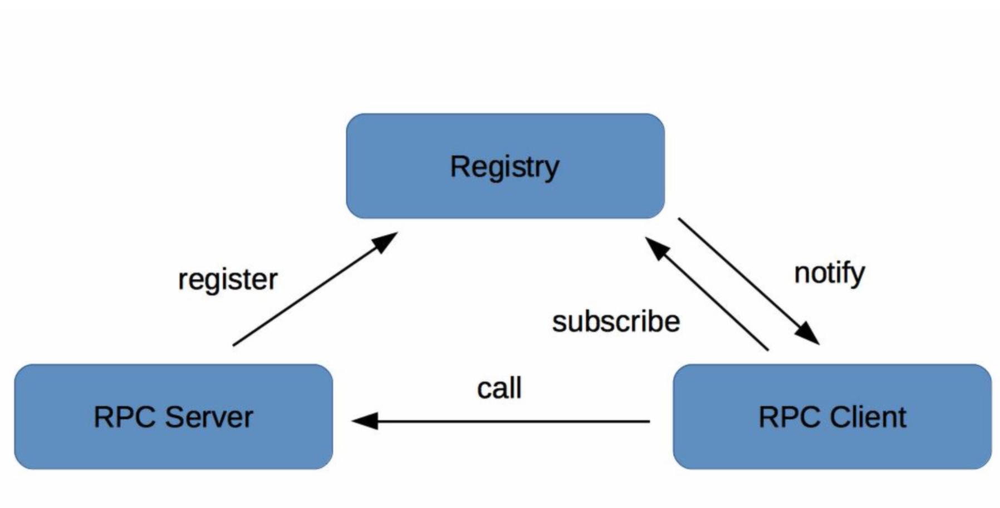
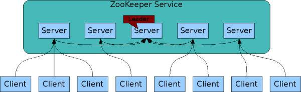

## 初探微服务架构

首先服务提供者（就是提供服务的一方）按照一定格式的服务描述，向注册中心注册服务，声明自己能够提供哪些服务以及服务的地址是什么，完成服务发布。

接下来服务消费者（就是调用服务的一方）请求注册中心，查询所需要调用服务的地址，然后以约定的通信协议向服务提供者发起请求，得到请求结果后再按照约定的协议解析结果。

而且在服务的调用过程中，服务的请求耗时、调用量以及成功率等指标都会被记录下来用作监控，调用经过的链路信息会被记录下来，用于故障定位和问题追踪。在这期间，如果调用失败，可以通过重试等服务治理手段来保证成功率。

总结一下，微服务架构下，服务调用主要依赖下面几个基本组件：

* 服务描述

常用的服务描述方式包括RESTful API、XML配置以及IDL文件三种。

* 注册中心

一般来讲，注册中心的工作流程是：

- 服务提供者在启动时，根据服务发布文件中配置的发布信息向注册中心注册自己的服务。
- 服务消费者在启动时，根据消费者配置文件中配置的服务信息向注册中心订阅自己所需要的服务。
- 注册中心返回服务提供者地址列表给服务消费者。
- 当服务提供者发生变化，比如有节点新增或者销毁，注册中心将变更通知给服务消费者。

* 服务框架

发起调用之前你还需要解决以下几个问题。

- 服务通信采用什么协议? e.g TCP UDP HTTP
- 数据传输采用什么方式? 同步还是异步，是在单连接上传输，还是多路复用。
- 数据压缩采用什么格式?

* 服务监控

一旦服务消费者与服务提供者之间能够正常发起服务调用，你就需要对调用情况进行监控，以了解服务是否正常。通常来讲，服务监控主要包括三个流程。

- 指标收集
- 数据处理
- 数据展示

* 服务追踪

除了需要对服务调用情况进行监控之外，你还需要记录服务调用经过的每一层链路，以便进行问题追踪和故障定位。

- 服务消费者发起调用前，会在本地按照一定的规则生成一个requestid，发起调用时，将requestid当作请求参数的一部分，传递给服务提供者。
- 服务提供者接收到请求后，记录下这次请求的requestid，然后处理请求。如果服务提供者继续请求其他服务，会在本地再生成一个自己的requestid，然后把这两个requestid都当作请求参数继续往下传递。

* 服务治理

服务监控能够发现问题，服务追踪能够定位问题所在，而解决问题就得靠服务治理了。服务治理就是通过一系列的手段来保证在各种意外情况下，服务调用仍然能够正常进行。

三种最常见的需要引入服务治理的场景

- 单机故障

服务治理可以通过一定的策略，自动摘除故障节点，不需要人为干预，就能保证单机故障不会影响业务。

- 单IDC(网络线路)故障

服务治理可以通过自动切换故障IDC的流量到其他正常IDC，可以避免因为单IDC故障引起的大批量业务受影响。

- 依赖服务不可用

服务治理可以通过**熔断**，在依赖服务异常的情况下，一段时期内停止发起调用而直接返回。这样一方面保证了服务消费者能够不被拖垮，另一方面也给服务提供者减少压力，使其能够尽快恢复。

## 发布和引用服务

### RESTful API

首先来说说RESTful API的方式，主要被用作HTTP或者HTTPS协议的接口定义，即使在非微服务架构体系下，也被广泛采用。

### XML配置

这种方式的服务发布和引用主要分三个步骤：

- 服务提供者定义接口，并实现接口。

- 服务提供者进程启动时，通过加载server.xml配置文件将接口暴露出去。

- 服务消费者进程启动时，通过加载client.xml配置文件来引入要调用的接口。

### IDL文件 （interface description language）

通过一种中立的方式来描述接口，使得在不同的平台上运行的对象和不同语言编写的程序可以相互通信交流。比如你用Java语言实现提供的一个服务，也能被PHP语言调用。

也就是说IDL主要是用作***跨语言平台的服务之间的调用***，有两种最常用的IDL：一个是Facebook开源的Thrift协议，另一个是Google开源的gRPC协议。无论是Thrift协议还是gRPC协议，它们的工作原理都是类似的。

## 注册和发现服务

将部署服务的机器地址记录到注册中心，服务消费者在有需求的时候，只需要查询注册中心，输入提供的服务名，就可以得到地址，从而发起调用

e.g zk, Spring eureka, consul

- RPC Server提供服务，在启动时，根据服务发布文件server.xml中的配置的信息，向Registry注册自身服务，并向Registry定期发送心跳汇报存活状态。
- RPC Client调用服务，在启动时，根据服务引用文件client.xml中配置的信息，向Registry订阅服务，把Registry返回的服务节点列表缓存在本地内存中，并与RPC Sever建立连接。
- 当RPC Server节点发生变更时，Registry会同步变更，RPC Client感知后会刷新本地内存中缓存的服务节点列表。
- RPC Client从本地缓存的服务节点列表中，基于负载均衡算法选择一台RPC Sever发起调用。

### 注册中心实现方式

1. 注册中心API

根据注册中心原理的描述，注册中心必须提供以下最基本的API，例如：

- 服务注册接口：服务提供者通过调用服务注册接口来完成服务注册。

- 服务反注册接口：服务提供者通过调用服务反注册接口来完成服务注销。

- 心跳汇报接口：服务提供者通过调用心跳汇报接口完成节点存活状态上报。

- 服务订阅接口：服务消费者通过调用服务订阅接口完成服务订阅，获取可用的服务提供者节点列表。

- 服务变更查询接口：服务消费者通过调用服务变更查询接口，获取最新的可用服务节点列表。

除此之外，为了便于管理，注册中心还必须提供一些后台管理的API，例如：

- 服务查询接口：查询注册中心当前注册了哪些服务信息。

- 服务修改接口：修改注册中心中某一服务的信息。

2. 集群部署

注册中心一般都是采用集群部署来保证高可用性，并通过分布式一致性协议来确保集群中不同节点之间的数据保持一致。

ZooKeeper的工作原理说起：

- 每个Server在内存中存储了一份数据，Client的读请求可以请求任意一个Server。

- ZooKeeper启动时，将从实例中选举一个leader（Paxos协议）。

- Leader负责处理数据更新等操作（ZAB协议）。

- 一个更新操作成功，当且仅当大多数Server在内存中成功修改 。

通过上面这种方式，ZooKeeper保证了高可用性以及数据一致性。

3. 目录存储

znode

4. 服务健康状态检测

注册中心除了要支持最基本的服务注册和服务订阅功能以外，还必须具备对服务提供者节点的健康状态检测功能，这样才能保证注册中心里保存的服务节点都是可用的。

以ZooKeeper为例，它是基于ZooKeeper客户端和服务端的长连接和会话超时控制机制，来实现服务健康状态检测的。

5. 服务状态变更通知

一旦注册中心探测到有服务提供者节点新加入或者被剔除，就必须立刻通知所有订阅该服务的服务消费者，刷新本地缓存的服务节点信息，确保服务调用不会请求不可用的服务提供者节点。

基于ZooKeeper的Watcher机制，来实现服务状态变更通知给服务消费者的。

6. 白名单机制

注册中心需要提供一个保护机制，你可以把注册中心想象成一个带有门禁的房间，只有拥有门禁卡的RPC Server才能进入。在实际应用中，注册中心可以提供一个白名单机制，只有添加到注册中心白名单内的RPC Server，才能够调用注册中心的注册接口，这样的话可以避免测试环境中的节点意外跑到线上环境中去。

### 总结

注册中心可以说是实现服务化的关键，因为服务化之后，服务提供者和服务消费者不在同一个进程中运行，实现了解耦，这就需要一个纽带去连接服务提供者和服务消费者，而注册中心就正好承担了这一角色。此外，服务提供者可以任意伸缩即增加节点或者减少节点，通过服务健康状态检测，注册中心可以保持最新的服务节点信息，并将变化通知给订阅服务的服务消费者。

注册中心一般采用分布式集群部署，来保证高可用性，并且为了实现异地多活，有的注册中心还采用多IDC部署，这就对数据一致性产生了很高的要求，这些都是注册中心在实现时必须要解决的问题。